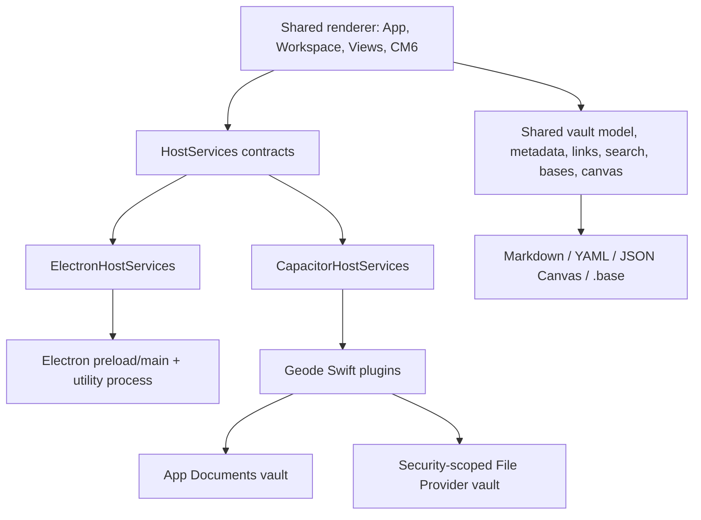

# ADR-0007: Mobile runtime and platform boundary

**Date:** 2026-08-28
**Status:** Proposed

## Context

Geode is an Electron 42 application with a mature TypeScript renderer. The renderer is already built by esbuild for the browser and owns the product model and UI for vault navigation, Markdown editing and Live Preview, links and backlinks, search, properties, attachments, Graph, Canvas, Bases, workspace state, themes, and the Obsidian-compatible plugin API. Replacing it would discard the most mature part of the application.

The reusable renderer is nevertheless coupled to Electron through 77 direct `window.geode` calls across 13 renderer files. The preload contract combines portable operations (vault reads/writes, configuration, cache, events) with desktop-only behavior (multiple windows, utility processes, process diagnostics, Chrome cookie import, Electron `<webview>` hotkeys, artifact guests, and power-save blockers). The plugin loader also deliberately delegates unknown CommonJS imports to Node so desktop plugins can use `fs`, `child_process`, and `electron`.

Capacitor v8 runs the web application in WKWebView on iOS. It supports adding a native shell to an existing modern JavaScript project and exposing custom Swift-backed plugins, but it does not provide Node, Electron, Electron utility processes, or Electron's `<webview>` element. Its current iOS toolchain requires Xcode 26 or newer and supports iOS 15 or newer. The official Capacitor filesystem API covers application-container/special-directory reads, writes, directory enumeration, and renames; access to user-selected File Provider locations, coordinated replacement, change observation, trash semantics, and security-scoped bookmark renewal require a Geode native plugin. File timestamp access also requires the applicable `PrivacyInfo.xcprivacy` declaration.

The problem is therefore not merely to package the desktop app. It is to preserve one application model and renderer while giving it honest, testable host capabilities on both Electron and iOS/iPadOS.

### Success criteria

The mobile MVP is credible when an iPhone or iPad user can, offline and after restart:

- create or open a local vault and navigate, search, read, create, edit, rename, move, attach to, and delete its files;
- use Live Preview, properties, links, backlinks, bookmarks, commands, Graph, Canvas, and Bases with touch and the on-screen keyboard;
- restore a mobile-appropriate workspace without corrupting a desktop layout;
- use an in-app Web Viewer and mobile-compatible community plugins;
- use the Claude Threads experience through an explicitly selected execution provider; and
- move between foreground/background and reconcile external File Provider changes without silent data loss.

Desktop behavior and its existing Vitest, Playwright, type-check, build, and parity gates must remain green throughout the migration.

### Hard constraints

- Preserve the existing TypeScript renderer, CodeMirror 6 editor, open file formats, and local-first source-of-truth semantics.
- Ship iOS and iPadOS first without preventing an Android adapter later.
- Do not expose a false Node or `FileSystemAdapter` capability on mobile.
- Continue to support trusted Node-capable plugins on desktop.
- Treat sync as a transport over local files, not as the source of truth for notes.
- Avoid a repository/package split until a real independent consumer requires one; source-level platform boundaries are sufficient for the MVP.

### Non-goals

- Running arbitrary Node/Electron plugins on iOS.
- Spawning Claude Code or another subprocess on the iOS device.
- Pop-out windows, desktop Chrome-cookie import, Electron artifacts, desktop process diagnostics, or desktop auto-update.
- Building a proprietary sync service as part of the mobile shell. File Provider/iCloud compatibility is in scope; a Geode-hosted sync backend is a separate decision.
- Pixel-identical desktop layout on a phone.

## Options considered

| Option | Pros | Cons |
|---|---|---|
| Wrap the existing renderer in Capacitor and emulate the entire `window.geode` preload object | Small initial diff; quickest shell boot | Electron assumptions remain implicit; unsupported calls fail at runtime; plugin and storage safety are difficult to test; every future platform repeats the shim |
| Keep the renderer and introduce an explicit, capability-based host boundary, implemented by Electron and Capacitor adapters | Reuses the mature product; makes unsupported behavior honest; enables contract tests and later Android support; can be migrated incrementally | Requires a deliberate seam through current direct host calls; some services need different implementations rather than one-for-one shims |
| Rewrite the client in SwiftUI and share only file formats or pure parsing code | Best access to native layout, lifecycle, keyboard, and Files APIs | Reimplements the editor, workspace, views, themes, plugin API, and behavior; creates permanent desktop/mobile divergence; makes current parity evidence largely irrelevant |

## Decision

Use **Capacitor with the existing renderer behind an explicit, capability-based host boundary**.

Capacitor is a shell and native bridge, not a second application architecture. Browser-safe domain logic and views remain shared. Electron and iOS implement the same narrow portable contracts where semantics match and expose capabilities for everything else. Unsupported behavior is gated before a user or plugin invokes it.

This decision is proposed rather than accepted until Slice 0 proves that the renderer can boot through the boundary with no Electron regression and the product chooses the mobile Claude Threads execution provider described below.

### 1. Boundary shape

Introduce a renderer-owned `HostServices` contract and inject it at bootstrap. Feature code receives a service (directly or through `App`) rather than reading Electron's preload object. The existing preload remains an implementation detail of `ElectronHostServices` and remains available as `window.geode` for desktop compatibility and host detection.

The contract is divided by responsibility so a portable feature never feature-detects individual methods on a large optional object:

| Service | Portable responsibility | Desktop implementation | iOS implementation |
|---|---|---|---|
| `runtime` | runtime, OS, form factor, lifecycle, capability snapshot | Electron/preload | Capacitor core + custom lifecycle bridge |
| `vaultRegistry` | create/import/select/open/list recent vaults | dialogs + window/session registry | native document/folder picker + bookmark registry |
| `vaultFiles` | list/stat/read/read-binary/write/mkdir/trash/rename/exists, change subscription, reconciliation | current main-process filesystem and watcher | Geode Swift vault plugin with coordinated file access |
| `config` | explicitly scoped vault and device configuration | current `.geode` files plus app data | vault `.geode` files plus application container |
| `metadataIndex` | persisted derived cache and optional background index capability | utility process initially | renderer fallback initially, then a Web Worker coordinator if profiling warrants it |
| `navigation` | deep links, local resource URLs, share/open external | Electron protocol and shell | Capacitor app URL handling, Share Sheet, and native browser services |
| `webContent` | create/navigate/close isolated in-app browsing surfaces | Electron `<webview>` | native child `WKWebView` coordinated with a renderer placeholder |
| `plugins` | manifests, files, policy, module capabilities, install/update | current trusted Node-capable loader | browser-only loader with native request/secret APIs and manifest gating |
| `diagnostics` | portable logs, crash breadcrumbs, performance spans | current process/crash services | OSLog/native crash reporting without desktop process metrics |

`HostServices.capabilities` is an immutable startup snapshot with named capabilities such as `multipleWindows`, `nodePlugins`, `embeddedWebContent`, `externalVaultFolder`, `backgroundIndexer`, `shareSheet`, and `threadExecution`. Capability checks drive UI availability, command availability, and plugin admission. They are not platform-name conditionals scattered through features.

The migration is incremental: first wrap the current preload without changing behavior, then move one responsibility at a time. A big-bang move to a package monorepo is specifically rejected.

### 2. Vault and storage semantics

The source of truth remains ordinary vault files. Metadata indexes, thumbnails, and reconciliation snapshots are derived and disposable.

The iOS adapter supports two vault locations:

1. **Managed vault (required first):** stored under the app's Documents container. It is the stable, fully testable default and can be imported/exported through Files.
2. **File Provider vault (required for MVP continuity, after managed storage is stable):** a folder chosen with `UIDocumentPickerViewController` in folder mode and represented by a persisted security-scoped bookmark. Access is balanced with `startAccessingSecurityScopedResource()` / `stopAccessingSecurityScopedResource()`, and every read/write is coordinated by the native adapter with `NSFileCoordinator`. Displayed external documents use `NSFilePresenter` where appropriate. If the bookmark is stale or access is revoked, the app becomes read-only and asks the user to re-authorize; it never silently creates a different empty vault.

All relative paths are normalized and checked against traversal before reaching native code. Writes use a temporary sibling plus atomic replace when the provider supports it. The native result returns authoritative `mtime`, creation time where meaningful, and size, matching the current vault model. A write is considered complete only after the replace finishes. Rename/move is serialized with writes touching either path.

The native adapter emits immediate events for app-originated mutations. External changes use `NSFilePresenter`/File Provider notifications where available and a manifest reconciliation on foreground, provider reconnect, and explicit refresh. The reconciliation compares path, type, size, and modification time; it batches events and preserves the existing `Vault` event contract. The app does not assume a desktop-style always-on watcher while suspended.

When the editor has unsaved text and reconciliation finds a different on-disk version, Geode must not overwrite either version. The MVP presents a conflict copy/review flow. It does not implement CRDT merging.

Configuration is split by scope:

- portable vault intent (appearance, plugin data, bookmarks, daily-note settings) remains under `.geode/`;
- volatile/device-shaped state (recent vault bookmarks, mobile workspace layout, caches, crash state) lives in the application container keyed by vault identity; and
- secrets use Keychain through a native service, never vault JSON or web local storage.

This prevents a phone workspace or stale cache from overwriting the desktop's layout through a sync provider.

### 3. Indexing and performance

The current metadata parser, link resolver, search, and incremental cache are browser-safe and remain shared. The Electron utility-process indexer remains the desktop fast path.

Mobile starts with the existing renderer fallback: hydrate a valid persisted cache, open the last file, then reconcile Markdown in bounded concurrent batches with event-loop yields. Cache storage is device-local. Only after measuring representative 1k, 8k, and 20k-file vaults should parsing move to a Web Worker. A worker design must batch file contents from the native bridge; it must not assume Capacitor APIs are callable inside a worker.

Mobile memory pressure cancels cold indexing after the current file batch and resumes later. Graph/backlinks visibly report partial indexing until `resolved`; they must not imply completeness.

### 4. Adaptive workspace and input

The workspace model and leaf/view lifecycle remain shared; presentation becomes adaptive.

- **Phone/compact:** one main tab group is visible. Left and right sidebars become full-height drawers. Additional saved splits remain serialized but dormant rather than being destroyed. A mobile tab switcher exposes open leaves. Status bar is hidden and ribbon actions move into a bottom/overflow action surface.
- **Tablet/regular:** sidebars may dock, two panes may be shown, and split handles receive touch-sized hit targets. Size-class/container queries, not user-agent strings, determine presentation.
- All menus, drag handles, Canvas nodes, Graph controls, tabs, and editor affordances use Pointer Events and minimum touch targets. Mouse/keyboard behavior remains intact.
- Safe-area insets, the virtual keyboard, hardware keyboards, text selection, rotation, Stage Manager resizing, and reduced motion are first-class test cases.
- Desktop and mobile layouts serialize independently while retaining compatible leaf view state.

Views do not fork into `FooMobileView` unless their information architecture truly differs. CSS and small presentation controllers adapt the same view first.

### 5. Plugin compatibility policy

Mobile compatibility is an admission decision, not a promise that every desktop plugin will limp along.

- A manifest with `isDesktopOnly: true` is not enabled on mobile.
- A mobile plugin receives the Obsidian-compatible browser API, shared CodeMirror/Lezer modules, DOM APIs, a mobile `DataAdapter`, privileged network requests, and Keychain-backed secret storage.
- `FileSystemAdapter` is a real desktop-only class. The mobile adapter must not satisfy `instanceof FileSystemAdapter` or expose an absolute POSIX path that suggests Node can access it.
- Unknown `require()` specifiers fail at plugin load with a diagnostic naming the unsupported module. There is no Node polyfill for `fs`, `path`, `child_process`, `electron`, streams, or native addons.
- Plugin settings and CSS are portable. Status-bar items are retained logically but not rendered on phone. Pop-outs, desktop process APIs, and Electron views are capability-gated.
- Community install UI labels plugins as Mobile compatible, Desktop only, or Unknown. Unknown plugins require explicit opt-in during the MVP and are automatically quarantined if startup fails.

The compatibility suite needs representative fixtures: pure DOM/view, CodeMirror extension, network/secret, CSS theme, explicit desktop-only, and an accidental Node import.

### 6. Claude Threads execution boundary

The current Claude Threads plugin depends on `FileSystemAdapter`, a real vault path, Node, and subprocess execution. WKWebView cannot run it unmodified, and presenting it as mobile-compatible would violate the plugin policy.

The shared mobile Threads UI therefore depends on a `ThreadExecutionProvider` capability with one of these product choices:

| Provider | Benefit | Cost/risk |
|---|---|---|
| Paired desktop Geode host | Preserves local tools, vault, and existing agent runtime | Desktop must be reachable; pairing, wake, transport encryption, and authorization are new product surfaces |
| Authenticated remote agent service | Works away from the desktop and can provide a complete mobile experience | Infrastructure, operating cost, secrets, repository/vault access, and trust model require separate approval |
| Read/capture-only local Threads | No infrastructure and useful offline | Does not meet the stated full-featured Threads outcome |

This ADR does **not** choose between paired desktop and remote service because that choice changes infrastructure, security, and product behavior. Slice 0 must obtain the product decision and a security design before mobile Threads implementation. Read/capture-only is an acceptable development fallback, not an MVP exit condition.

### 7. Web Viewer

Electron's `<webview>` cannot be emulated with an iframe: many sites disallow framing, and it would lose an isolated navigation/session boundary. The iOS `webContent` service hosts a child `WKWebView` above a measured renderer placeholder and bridges navigation, title, history, crash, keyboard, and visibility events. It uses an isolated data store by default. Chrome cookie import is desktop-only.

If a stable child-WKWebView integration cannot meet rotation, keyboard, accessibility, and lifecycle tests, the fallback is `SFSafariViewController`/Capacitor Browser. That fallback is explicitly a reduced Web Viewer and would require changing the full-featured MVP exit criteria rather than being described as parity.

## Delivery sequence

Every slice is vertical and leaves desktop gates green. A slice is not complete with only a shell or static screenshot.

### Slice 0 — Boundary proof and risk retirement

- Add the `HostServices` contracts and an Electron adapter over the current preload.
- Boot the existing desktop renderer exclusively through the adapter; preserve `window.geode` for compatibility.
- Add service contract tests and keep type-check, Vitest, Electron Playwright, build, and parity check green.
- Build a disposable Capacitor iOS spike that boots the real renderer bundle, mounts CodeMirror, reads/writes one managed-vault note, backgrounds/foregrounds, and restores it.
- Measure bundle boot, keyboard behavior, a 1k-note cache hydrate, and memory on a supported iPhone and iPad simulator/device.
- Confirm whether the product floor should be Capacitor v8's iOS 15 minimum or a higher floor, and decide the Claude Threads execution provider. Record the provider/security choice in a follow-up ADR.

The current local environment does not have the required full Xcode 26/simulator toolchain. Source extraction and browser/fake-host tests may proceed, but this slice cannot exit until its native build, lifecycle, and persistence checks run on an equipped macOS host. A browser-only pass is not equivalent evidence.

**Exit:** no desktop regression, no Electron import in the mobile bundle, persisted offline edit survives restart, and the two riskiest product decisions have owners.

### Slice 1 — Managed-vault daily core

- Native managed-vault registry and atomic filesystem adapter, including the required `PrivacyInfo.xcprivacy` entries.
- Mobile launch/vault picker, file explorer drawer, tabs, Markdown read/edit/Live Preview, create/rename/move/trash, links/backlinks, properties, attachments, search, quick switcher, commands, settings, bookmarks, themes, and device-scoped layout/cache.
- Touch, safe-area, software/hardware keyboard, rotation, autosave, background/foreground reconciliation, and crash/restart coverage.

**Exit:** the primary daily knowledge workflow works offline end-to-end on iPhone and iPad and no tested interruption loses the last confirmed save.

### Slice 2 — Complex local views

- Graph pan/zoom/select, Canvas nodes/edges/cards, and Bases table/cards with Pointer Events and adaptive controls.
- Attachment import/share and resource URL handling.
- Large-vault partial-index UX and memory-pressure recovery.

**Exit:** representative Graph, Canvas, and Base fixtures can be created, edited, persisted, reopened, and manipulated by touch.

### Slice 3 — Mobile plugin runtime

- Capability-aware CommonJS loader, `DataAdapter`, native request/secret services, manifest gating, settings, styles, quarantine, and compatibility labels.
- Run the mobile plugin fixture suite and at least one real mobile-compatible community plugin through install, enable, restart, update, disable, and failure recovery.

**Exit:** supported plugins work across restart and desktop-only/accidentally-Node plugins are blocked before executing unsupported code.

### Slice 4 — In-app Web Viewer

- Native child-WKWebView service, shared Web Viewer controls/state, deep/external links, crash recovery, isolation, keyboard routing, and Canvas web-card integration where feasible.

**Exit:** navigation/history/reload/restore and common authentication flows survive rotation and backgrounding without obscuring or navigating away from Geode.

### Slice 5 — Vault continuity

- Security-scoped File Provider folder access, bookmark renewal, coordinated operations, notification/foreground reconciliation, provider-offline behavior, and conflict copies.
- Validate iCloud Drive with two-device edits and provider eviction/re-download. Document unsupported provider combinations rather than implying safety.

**Exit:** a provider-backed vault can be edited offline, reconciled after reconnect, and exercised concurrently without silent overwrite or duplicate empty vault creation.

### Slice 6 — Claude Threads mobile experience

- Implement the separately approved `ThreadExecutionProvider` and reuse/adapt the Threads UI behind that boundary.
- Pair/sign in, list/open/create/resume/cancel threads, stream output, approve tool actions, attach vault context, handle disconnect/reconnect, and preserve drafts offline.
- Threat-model credentials, authorization, vault scope, link opening, and destructive tool approval. Add revocation and lost-device behavior.

**Exit:** a user can complete a real agent task from phone and iPad, with explicit approvals and recovery across a dropped connection, without exposing a broader vault or tool scope than selected.

### Slice 7 — MVP hardening and release candidate

- Accessibility, performance budgets, migration/rollback, onboarding, diagnostics, privacy strings, signing, entitlements, App Store metadata, and support runbook.
- Full desktop gate plus mobile bundle contract tests, responsive Playwright tests with a fake host, native storage XCTest, and XCUITest smoke flows on the supported iPhone/iPad matrix.
- Add durable mobile evidence to the parity ledger; code inspection alone does not mark mobile behavior verified.

**Exit:** all included capabilities have automated or durable device evidence, no P0/P1 defect remains, a managed and provider-backed vault both pass interruption tests, and the release candidate installs cleanly on physical devices.

## Verification strategy

| Layer | Required evidence |
|---|---|
| Pure domain and view-model logic | Existing/new Vitest tests, including capability and reconciliation edge cases |
| Host contract | One shared conformance suite run against fake, Electron, and Capacitor adapter implementations |
| Responsive renderer | Playwright against the mobile bundle with a deterministic fake native host at phone/tablet viewports and touch input |
| Native filesystem and bookmarks | XCTest for traversal rejection, atomic replace, coordinated rename/write, revoked/stale bookmark, provider offline, conflict, and foreground reconcile |
| Native shell | XCUITest primary flows on smallest supported phone, current large phone, iPad portrait/landscape, hardware-keyboard path, rotation, background, termination, and relaunch |
| Desktop regression | `npm run typecheck`, `npm run test:unit`, `npm run test:e2e`, `npm run build`, and `npm run parity:check` on every slice |
| Performance | Cold/warm launch and index runs at 1k/8k/20k notes; memory warning/resume; editor input latency; Canvas/Graph representative fixtures |
| Visual/accessibility | Checked-in screenshots for phone/tablet states, Dynamic Type, light/dark, safe areas, VoiceOver labels/order, contrast, and 44pt touch targets |

No mobile test replaces the desktop gate, and a responsive browser screenshot does not replace native lifecycle/storage evidence.

## Consequences

### Easier

- One product model, renderer, plugin API, and open-format implementation serves desktop and mobile.
- Platform limitations become discoverable and testable instead of runtime surprises.
- Android can later implement the same host contracts without forking the application.
- Electron-specific hardening can continue without leaking into portable features.
- Local files remain authoritative and usable outside Geode.

### Harder

- The first useful mobile release requires boundary work before visible feature work.
- Native Swift is required for robust vault access and embedded web content; the stock filesystem/browser plugins alone do not meet the target semantics.
- Some apparently shared views need meaningful touch and lifecycle work.
- Mobile plugin compatibility is necessarily smaller than desktop compatibility.
- Full Claude Threads on mobile adds a paired-host or remote-service security boundary.

### What we are giving up

- A very fast but fragile shell that claims unsupported Electron methods exist.
- Pixel-identical layout and arbitrary Node plugin parity on phones.
- The simplicity of treating `window.geode` as the application's permanent architecture.
- A claim of complete mobile Threads functionality without funding its execution and trust model.

## Risks

1. **Threads execution is the largest product risk.** Neither paired desktop nor remote service has yet been selected or threat-modeled. Without one, the stated MVP cannot exit.
2. **File Provider semantics vary.** Notifications, eviction, coordination, and bookmark renewal may differ across iCloud and third-party providers. Managed vaults remain the safety baseline, and provider support must be evidence-based.
3. **WKWebView memory and background rules may make the desktop startup/index strategy unacceptable.** Cache-first startup, bounded work, cancellation, and measured budgets are mandatory.
4. **The workspace is visually desktop-first.** CSS alone may not solve keyboard, drawers, tabs, Canvas, Graph, and drag interactions; targeted presentation controllers may be necessary.
5. **Embedded Web Viewer is a native compositing risk.** A child WKWebView must remain aligned and accessible through resize, rotation, keyboard, and app suspension.
6. **Plugins may feature-detect incorrectly.** Some claim mobile support while importing Node lazily. Admission plus runtime module denial and quarantine are both required.
7. **Shared-vault configuration can conflict.** Device-scoped volatile state must not be written into synced vault state.

## What would revise this decision

- The Slice 0 spike shows the real renderer or CodeMirror cannot meet acceptable input latency or memory on supported devices.
- Extracting a host boundary causes pervasive platform forks rather than reducing them.
- Apple platform rules prevent the required local-vault or approved Threads execution model.
- Product scope changes to a companion/capture app; in that case a smaller native client may become preferable.
- A separately approved sync/runtime architecture structurally requires a different client boundary.

## Open decisions

- Paired desktop versus remote service for `ThreadExecutionProvider`.
- Supported iOS/iPadOS floor (the existing spec notes regex lookbehind requires iOS 16.4+; the spike must verify actual dependencies and device coverage).
- Which File Providers are supported at MVP launch beyond iCloud Drive.
- Whether child-WKWebView Canvas cards are MVP-critical or may open in the full Web Viewer.
- App Store versus internal/TestFlight first distribution and the associated entitlement/review constraints.

## Documentation used

- Geode technical specifications: [`docs/spec/01-core-app.md`](../spec/01-core-app.md), [`docs/spec/03-plugin-api.md`](../spec/03-plugin-api.md), and [`docs/spec/04-formats-and-platform.md`](../spec/04-formats-and-platform.md).
- Capacitor runtime and custom-plugin source documentation: <https://github.com/ionic-team/capacitor>.
- Capacitor Filesystem documentation: <https://github.com/ionic-team/capacitor-filesystem>.
- Capacitor v8 documentation: <https://capacitorjs.com/docs>, <https://capacitorjs.com/docs/ios>, <https://capacitorjs.com/docs/apis/filesystem>, and <https://capacitorjs.com/docs/plugins/creating-plugins>.
- Apple directory access guidance: <https://developer.apple.com/documentation/uikit/providing-access-to-directories>.
