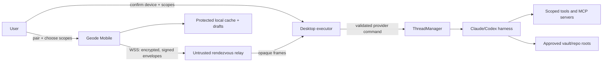
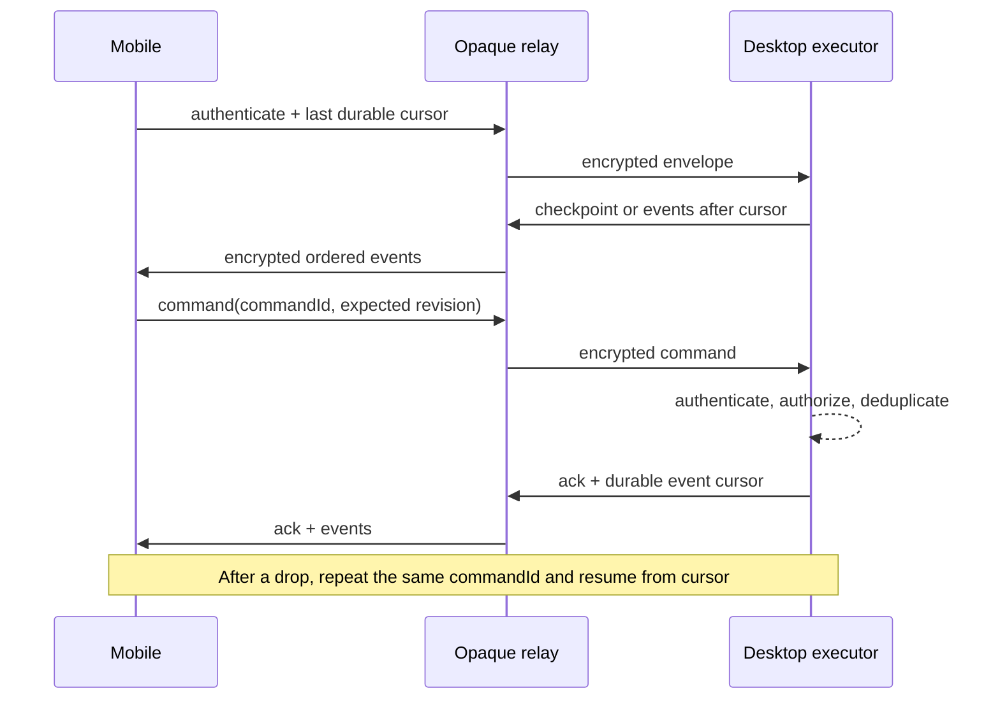

# ADR-0008: Mobile Claude Threads execution provider

**Date:** 2026-08-29
**Status:** Proposed

## Context

Geode Mobile must offer the Claude Threads experience without pretending that an iOS WebView can run the existing desktop agent runtime. Today Claude Threads starts Claude Code or Codex through Node/subprocess APIs, uses real filesystem working directories, reads a desktop `FileSystemAdapter`, hosts local tools and MCP servers, and persists live thread state and raw logs beside the desktop vault. Those are executor responsibilities, not portable UI responsibilities.

There is already a useful paired-desktop prototype in the sibling `obsidian-claude-threads` repository:

- `RelayClient`, `MobileThreadStore`, `MobileView`, and `relay-protocol.ts` separate a mobile presentation client from the desktop `ThreadManager`;
- a Cloudflare Worker/Durable Object forwards WebSocket frames between one desktop and one mobile client;
- the mobile client can view threads and streaming output, send prompts, stop a session, create a thread, answer questions, and resolve tool permissions; and
- the desktop remains the only process that starts the agent harness or touches its working directory.

This substantially retires the UI-feasibility risk, but the current relay protocol is not a production security or reliability boundary. A 32-character room ID in the URL is both rendezvous identifier and long-lived bearer secret. The relay can read every frame. Either peer role can be claimed by anyone who knows the URL. Initial expiry is checked only after a mobile connection reaches the desktop, paired devices have no durable identity, revocation rotates every device at once, all thread history and absolute working directories are snapshotted, and disconnected commands are blindly replayed without acknowledgements or idempotency keys. A dropped/replayed approval or prompt can therefore have materially different consequences than a dropped UI event.

ADR-0007 requires a separately approved `ThreadExecutionProvider` and identifies three product choices: paired desktop execution, authenticated remote execution, or local read/capture only. This ADR makes that choice decision-ready and defines the trust and behavioral contract that any implementation must satisfy.

### Problem statement

Allow an authorized phone or iPad to operate a real Claude Thread against explicitly selected desktop or hosted resources, including streaming, reconnect, questions, and tool approvals, without granting the relay, a lost device, or a compromised client broader access than the user selected.

### Hard constraints

- No Node, subprocess, Claude/Codex CLI, desktop tool server, or absolute filesystem path is exposed as an iOS capability.
- The executor remains authoritative for thread state, policy, tools, files, repositories, and side effects.
- The mobile app is an authenticated command client and a local cache; it is never authoritative for whether an action ran.
- Notes remain local-first. Adding mobile Threads must not turn the entire vault into server-owned state.
- One provider-neutral mobile UI must support a paired desktop now and a hosted executor later without migrating view code or silently changing trust.
- A network interruption must not duplicate a prompt, approval, cancellation, or other side effect.
- No relay or hosted service may receive vault, repository, conversation, tool, or credential plaintext unless the user explicitly approves that trust model.

### Success criteria

For the full-featured mobile MVP, a user can pair an iPhone or iPad, select an allowed vault/repository scope, list/open/create/resume/cancel threads, follow streamed output, answer agent questions, make explicit tool decisions, attach scoped vault context, and recover after a dropped connection. Losing or revoking the device ends its ability to reconnect or issue commands. Drafts survive offline, but offline state never masquerades as executed work.

### Non-goals

- Running an agent harness locally on iOS.
- Waking a powered-off Mac through an unproven wake service.
- General remote desktop or terminal access.
- Synchronizing arbitrary desktop files to mobile.
- Designing a proprietary vault-sync backend.
- Transparently moving a live thread between two executors.
- Supporting unattended mobile approval of arbitrary high-risk tools.

## Actors, data, and trust boundaries

| Actor | Trusted for | Must not be trusted for |
|---|---|---|
| Mobile Geode app | displaying authenticated executor state; holding its own device key and encrypted local drafts/cache; collecting an explicit user decision | validating filesystem scope, deciding whether a command executed, or enforcing desktop tool policy |
| Desktop Geode + Claude Threads executor | thread truth, process lifecycle, working-directory validation, sandbox/tool policy, durable event log, permission expiry, and side effects | assuming that relay origin or possession of a room name proves device identity |
| Rendezvous relay | routing bounded opaque frames and enforcing transport quotas | reading content, authorizing a device, interpreting commands, or establishing execution scope |
| Hosted execution service (future option) | only the tenants, resources, and secrets explicitly entrusted to it | ambient access to a user's full vault, desktop, repositories, or unrelated tenants |
| Agent harness and tools | only the effective per-thread capability set granted by the executor | mobile identity, pairing, or scope validation |
| User | pairing, selecting scopes, approving trust/availability tradeoffs, and resolving sensitive actions | remembering that an old device remains authorized without visible device management |

The primary paired-desktop trust boundary is:

The relay observes connection metadata and ciphertext size/timing. It cannot be described as zero-knowledge without separately proving padding and metadata protections; the MVP does not make that claim.

## Options considered

| Option | What it enables | Advantages | Costs and failure modes |
|---|---|---|---|
| **A. Paired desktop executor through an opaque relay** | Full current Claude Threads feature set while a paired desktop is online and reachable | Reuses the proven `ThreadManager`, Claude/Codex harnesses, local credentials, MCP servers, repositories, vault, and existing mobile UI prototype; plaintext and model credentials stay on user-controlled devices; smallest new execution surface | Desktop availability becomes product behavior; requires a hardened pairing/auth/E2EE protocol, relay operations, reconnect semantics, scope enforcement, device management, and clear “desktop unavailable” UX; mobile cannot finish agent work while the desktop is off |
| **B. Authenticated multi-tenant remote executor** | Agent work when the desktop is unavailable | Best away-from-home availability; central versioning, scheduling, and observability; can eventually support web clients | Introduces account/auth, tenant isolation, hosted compute, secrets custody, repository checkout, vault context upload/sync, quotas/billing, abuse controls, data retention/deletion, incident response, and ongoing per-turn cost; existing local-only tools and files do not automatically exist in the service |
| **C. Local read/capture-only Threads** | Cached history and offline drafts that can be sent later | Smallest security and infrastructure surface; genuinely useful offline; no false local execution | Cannot run, resume, stop, or approve a live agent and therefore does not meet the full-featured Threads exit criterion |

### Stress test

- If the Mac sleeps, loses power, or changes network, Option A is unavailable until it reconnects. A relay cannot fix executor absence.
- If the remote service is compromised, Option B may expose tenant prompts, repository/vault context, credentials, and tool authority unless the product severely narrows the hosted scope. End-to-end encryption cannot hide data from a service that must execute on it.
- If the network drops immediately after a mobile command, all options need idempotent commands and authoritative reconciliation. Replaying an unacknowledged command is unsafe.
- If a phone is stolen after pairing, a room secret alone cannot distinguish the stolen phone from the user. Per-device identity and revocation are required.
- If mobile and desktop have different versions of a note, a path alone is ambiguous. Context attachment needs a content hash and an explicit mismatch path.

## Decision

For the mobile MVP, use **Option A, a paired desktop executor through an end-to-end encrypted rendezvous relay**, and include **Option C only as its disconnected/offline state**. Do not build Option B for the MVP.

This is a recommendation, not yet an accepted product decision. It is tied to the current constraints: the complete executor already exists on desktop; the mobile thin-client behavior already has working code; and a hosted executor would create a new security-, infrastructure-, and operations-heavy product before the mobile knowledge workspace itself is proven. The trade is explicit: “full-featured” means full capability when the paired desktop is reachable, not autonomous cloud execution while it is off.

The existing relay implementation is a prototype to mine for UI and event semantics. It must not ship unchanged. Production work begins behind a provider-neutral interface and replaces room-ID bearer authorization with per-device authentication, explicit scopes, encrypted envelopes, command acknowledgements, and replay protection.

If the product requirement is instead “agent work must continue when my desktop is off,” this recommendation is invalid and Option B must be separately funded and threat-modeled before implementation.

## Provider boundary

The shared UI depends on a `ThreadExecutionProvider`, conceptually divided into these responsibilities:

| Responsibility | Required behavior |
|---|---|
| Provider/session discovery | Report provider kind, executor availability, authenticated device/account, protocol version, authorized scopes, and capability flags without platform-name branching |
| Thread queries | Page thread summaries; fetch a selected thread and messages by cursor; expose running/waiting/offline state; never require an all-history monolithic snapshot |
| Commands | Create/resume/message/cancel/answer/approve with a client-generated command ID, expected thread revision, acknowledgement, and final disposition |
| Event stream | Ordered executor events with provider instance ID, thread ID, monotonically increasing cursor, event ID, and resumable checkpoint |
| Context | Reference an approved executor-side resource by opaque scope ID + vault-relative path + content hash, or explicitly upload an encrypted snapshot when mismatch policy permits |
| Device management | Pair, name, list, last-seen, narrow scopes, and revoke individual devices; rotate executor identity through a recovery flow |

Thread IDs are namespaced by provider identity. A local cache entry is not treated as proof that the same thread still exists on the executor. Provider switching is explicit in the UI; the app does not merge histories merely because titles match.

## Paired-desktop design

### Transport and rendezvous

- Use outbound `wss://` connections from mobile and desktop to a minimal relay so neither device needs an inbound port or public IP.
- The relay receives an opaque, high-entropy rendezvous identifier. This identifier locates a channel; it is not sufficient to authorize a command.
- Application envelopes are end-to-end encrypted and authenticated between the paired mobile device and desktop. Use audited platform cryptography and a reviewed protocol; do not invent a custom cipher or treat TLS termination at the relay as end-to-end encryption.
- Each envelope includes protocol version, executor ID, device ID, connection/session ID, monotonically increasing sequence number, message/command ID, ciphertext, and authenticated metadata needed for replay rejection.
- The relay enforces connection, frame-size, idle, and rate limits and retains no message bodies after delivery. Its inability to decrypt is the security control; a privacy promise alone is not.
- LAN/direct transport may be added as another transport beneath the provider later. It is not needed for MVP and must preserve identical authentication and replay semantics.

### Pairing and authentication

1. Desktop creates an expiring, single-use pairing session and shows a QR code containing the relay location, rendezvous material, desktop identity/public key, protocol version, and one-time proof material. The code is not the long-lived credential.
2. Mobile creates a non-exportable-per-install device identity where the platform permits, stores private material in Keychain with device-only accessibility, and sends a proof through the encrypted pairing channel.
3. Both devices display a human-readable fingerprint/short authentication string. Desktop requires a local confirmation that includes the mobile device name and requested scopes. Scanning a QR alone is not final authorization.
4. Desktop persists the mobile public identity, assigned scopes, creation time, and revocation state. Mobile persists the desktop identity and assigned provider ID. Reconnect uses mutual proof of those identities, not the expired QR payload.
5. Pairing expires after five minutes or first successful use. Replays fail. A new device creates a separate authorization record.

The exact authenticated key-agreement construction and library require focused security review. That review is an implementation gate, not permission to fall back to a shared room bearer token.

### Vault, repository, and thread scope

Authorization is deny-by-default and checked at the desktop executor on every command.

- During pairing, the desktop user selects zero or more vaults and repository/worktree roots. Mobile sees opaque scope IDs and human-readable labels, never authority-bearing absolute paths.
- A thread belongs to one approved execution scope. Creating or moving a thread cannot supply a raw `cwd`; it supplies an opaque scope ID, and the desktop resolves and containment-checks the path.
- Pairing separately chooses which thread set is visible: selected projects/scopes, selected existing threads, or (only through an explicit broad choice) all current and future threads. The current behavior of snapshotting every thread is not the default.
- The executor intersects device scope, thread scope, agent sandbox, tool policy, and the request-specific approval. Mobile cannot widen any of them.
- Vault context references use `{vaultScopeId, relativePath, contentHash}`. The desktop reads its own scoped file and verifies the hash. On mismatch, the user chooses the desktop version or attaches the mobile bytes as a named encrypted snapshot; Geode never silently overwrites either copy.
- Secrets, environment variables, MCP credentials, raw logs, and absolute paths remain executor-side. UI diagnostics redact them before streaming.

Repository containment is not by itself an agent sandbox. The desktop provider must launch the harness with an effective sandbox/tool policy that enforces the advertised scope; otherwise the UI label is only cosmetic.

### Commands, approvals, and side effects

- Every mobile command has a UUID, target thread revision, creation time, and explicit expiry. The executor durably deduplicates command IDs for a bounded period and returns `accepted`, `rejected`, or `already_applied` plus the authoritative event cursor.
- Mobile may retry an unacknowledged idempotent envelope with the same command ID. It never creates a new ID merely because the connection dropped.
- Approval requests are executor-created, single-use, short-lived, and bound to the exact tool invocation digest, thread revision, normalized scope, and risk summary. An approval for one invocation cannot authorize a changed command.
- Mobile signs the decision. The executor verifies device authorization and that the request is still pending before applying it; late/replayed responses are rejected.
- MVP mobile offers **Allow once** and **Deny**. It does not create or widen a persistent `always allow` rule remotely. Existing desktop standing rules remain desktop-managed.
- Destructive filesystem actions, publishing/external messaging, credential access, privilege escalation, and scope expansion are visually distinct. The product must decide which require a native biometric/passcode step-up and which, if any, remain desktop-confirm-only.
- Revocation wins over queued traffic: the executor checks current device status at application time, not merely WebSocket connection time.

### Streaming, reconnect, and authoritative state

The current token-frame stream is retained as a presentation optimization, not as the recovery record.

- The desktop maintains a bounded durable per-thread event journal or can synthesize a checkpoint from persisted thread state.
- Mobile records the last applied durable cursor per provider/thread. Token deltas may be dropped or coalesced; finalized messages, pending approvals/questions, command dispositions, and terminal status are durable.
- On reconnect, desktop returns events after the cursor or a versioned checkpoint if the cursor aged out. A checkpoint includes currently running threads and pending interactions; it is paginated/bounded and does not assume a sub-1 MB all-thread snapshot.
- Duplicate events are ignored by event ID. Gaps trigger replay/checkpoint, not optimistic continuation.
- `desktop unavailable`, `relay unavailable`, `revoked`, `scope removed`, and `protocol upgrade required` are distinct states with distinct recovery actions.

### Offline drafts

- Draft text, pending image references, selected target thread/scope, and last visible cached history are stored in the protected application container, encrypted with a Keychain-held device key.
- Drafts never display as sent and are not appended to authoritative thread history until acknowledged by the executor.
- The MVP does not silently flush executable commands after reconnect. A draft becomes a send only after the user confirms while connected; a queued-send feature can be added later with an explicit outbox, expiry, cancellation, and idempotency UI.
- Approval, question response, stop, and scope-change commands are never stored as offline outbox items because their meaning is time-sensitive.
- Images or context snapshots have a size limit and explicit retention. Removing a draft deletes its local payload.

### Revocation, recovery, and lost devices

- Desktop settings list each paired device with name, created time, last seen, scopes, and a one-click individual revoke action. “Revoke all” rotates the desktop executor identity and invalidates all sessions.
- Revocation closes the live channel where possible and always prevents the next envelope from being applied. Relay disconnection alone is not revocation.
- Mobile unpair removes device credentials, cached conversation content, and pending attachments/drafts after an explicit warning. Normal app uninstall relies on iOS data protection but the desktop authorization must still be revocable independently.
- A lost desktop/executor identity requires pairing devices again. There is no cloud recovery of local executor keys in the MVP.
- The desktop surfaces recent connection and sensitive-command audit records without storing prompt/tool plaintext in relay logs.

## Authenticated remote execution option

Option B must implement the same provider contract, command/event identifiers, and mobile cache semantics, but it changes the trust model:

- account authentication and device sessions replace desktop-only pairing;
- the hosted service becomes the executor and necessarily sees the plaintext it executes on;
- each tenant needs isolated compute, storage, secrets, repository credentials, network policy, quotas, audit, retention/deletion, and incident response;
- vault context is opt-in, content-addressed, encrypted in transit/at rest, minimized to selected items, and deleted under a documented policy; and
- remote tools must be explicitly supported service capabilities, not assumptions that a user's desktop MCP servers or filesystem exist in the cloud.

No hosted mode may reuse a paired-desktop room ID as account authentication. It requires a separate account, authorization, privacy, cost, and tenancy ADR plus an operational readiness review.

## Operational cost and ownership

| Area | Paired desktop MVP | Hosted executor |
|---|---|---|
| Compute | User's Mac runs harnesses; relay only routes frames | Per-user agent workers, sandboxes, repo storage, indexing, and model/tool traffic |
| Stateful infrastructure | Device authorization on desktop; ephemeral relay connections and quotas | Identity, tenant metadata, durable threads/events, secrets, artifacts, billing/quotas, retention jobs |
| On-call surface | Relay availability, protocol compatibility, abuse/rate limiting, desktop connectivity diagnostics | All paired costs plus worker scheduling, isolation escapes, credential compromise, data deletion, regional availability, spend/runaway agents |
| User-visible limitation | Desktop must be awake, Geode running, and connected | Tools/files differ from desktop unless explicitly uploaded/integrated |
| Primary cost risk | Long-lived WebSocket/bandwidth growth and support burden for unreachable desktops | Unbounded compute/model spend and security/compliance overhead |

The MVP needs an owner for the relay, availability/latency/error metrics, connection and frame quotas, a privacy statement, protocol deprecation policy, and an incident/revocation runbook. “Stateless pipe” does not mean “zero operations.”

## Migration path

1. Extract the existing mobile store/view behavior behind `ThreadExecutionProvider`; keep a deterministic fake provider for renderer tests.
2. Version the existing relay protocol and replace raw snapshots/commands with cursored events, acknowledgements, idempotency, and bounded pagination.
3. Add device identity, explicit desktop confirmation, scope records, individual revocation, and audited end-to-end encrypted envelopes.
4. Ship paired-desktop provider with the offline cache/draft fallback and mobile-safe approval UX.
5. If later approved, add a remote provider as a second executor implementing the same client contract. Do not make cloud execution an implicit upgrade.
6. Offer an explicit thread export/import or “continue in another provider” flow only for settled threads. Preserve original provider ID and provenance; never transfer an in-flight approval or claim uninterrupted execution.

This sequence reuses the current proof without freezing its bearer-room security model into a public interface.

## Verification requirements

- Protocol schema/compatibility tests reject unknown versions, malformed envelopes, oversized frames, stale revisions, expired approvals, scope escalation, and raw absolute path leakage.
- Security tests cover stolen/guessed rendezvous IDs, wrong device keys, replayed frames, sequence rollback, altered ciphertext, role spoofing, revoked devices, pairing expiry/reuse, and cross-room/cross-scope injection.
- Reliability tests drop the network before and after each command acknowledgement and prove that prompts, stops, approvals, and thread creation apply at most once.
- Reconnect tests cover replay from cursor, cursor expiry/checkpoint, desktop restart with a new provider instance ID, running turns, pending questions/permissions, and protocol upgrade required.
- Scope tests prove a mobile device cannot enumerate or target threads, vault files, repos, tools, or MCP servers outside its grant even when it fabricates IDs or paths.
- Local-data tests cover protected storage, draft/cache deletion on unpair, iOS backup policy, attachment retention limits, and locked-device behavior.
- Human tests cover pairing fingerprint comparison, device naming, narrow-scope defaults, destructive approval comprehension, revocation, desktop-unavailable messaging, and no false “sent” state offline.
- Relay inspection proves logged URLs/telemetry exclude pairing proofs, keys, content, raw commands, vault paths, and repository paths.

## Consequences

### Easier

- The mobile MVP reuses the working desktop agent runtime and the existing thin-client proof.
- Model/API credentials, local tools, repositories, and vault plaintext remain on user-controlled devices.
- A provider contract isolates the mobile UI from executor placement and preserves a later hosted path.
- Per-device grants and cursored/idempotent commands make loss, reconnect, and audit behavior explicit.

### Harder

- The desktop's availability is part of the mobile product and needs honest status/support UX.
- Pairing is a real security protocol, not a QR convenience flow.
- Executor-side scope enforcement may require tightening existing harness sandbox and tool policies.
- Thread/event pagination, acknowledgement, durable cursors, and device management add work beyond the current prototype.
- The relay still has operational cost and metadata exposure even though it cannot read content.

### What we are giving up

- Claude Threads execution while the paired desktop is off.
- Shipping the current shared-room relay unchanged.
- Remote “always allow” as an MVP convenience.
- Treating a raw path or synchronized note name as proof that both devices mean the same bytes.
- An illusion that hosted execution can be added later without a separate trust and operations decision.

## Risks

1. **Availability expectation:** users may hear “full-featured mobile” as “works with the Mac off.” Onboarding and product language must state the paired-host constraint before purchase/install.
2. **Cryptographic implementation:** an unaudited pairing/E2EE construction can be worse than explicit server trust. Security review is an exit gate.
3. **Scope enforcement gap:** current tools and agent sandboxes may have authority beyond a thread's `cwd`. A UI scope selector does not fix that by itself.
4. **Protocol growth:** full snapshots, base64 images, raw logs, and tool events can exceed relay/frame/mobile-memory budgets. Pagination, attachment transfer limits, and durable cursors are mandatory.
5. **Mobile approvals:** small-screen summaries can hide material commands. Approval payloads need normalized, non-truncated risk details and expiration.
6. **Desktop lifecycle:** sleep, app updates, crashes, and multiple Geode instances can invalidate the assumed single authoritative executor. Provider instance identity and recovery behavior must be tested.
7. **Relay abuse/metadata:** an opaque relay can still be attacked and can observe timing/IP metadata. Quotas and a clear privacy claim remain necessary.

## Product and infrastructure decisions requiring owner approval

The following are deliberately not decided by architecture alone:

1. **Availability contract:** approve paired-desktop execution for MVP, accepting that Threads cannot execute while the Mac is unavailable, or fund authenticated hosted execution instead.
2. **Trust and hosting:** approve operation of the rendezvous relay (including provider, privacy posture, budget, owner, and support/SLO) or require a user-self-hosted-only release.
3. **Pairing scope default:** choose selected projects/threads (recommended) versus all current and future threads.
4. **High-risk approvals:** choose which actions require native biometric/passcode step-up, which are mobile-approvable once, and which remain desktop-only.
5. **External context:** approve whether mobile may upload an encrypted note/image snapshot to the paired desktop when the desktop's content hash differs, and define retention limits.
6. **Device count and sharing:** decide single personal mobile device versus multiple devices; this ADR's identity model supports multiple, but the current relay does not.
7. **Hosted future:** decide whether autonomous off-desktop execution is a committed follow-on or merely an architectural option. Any commitment requires a separate account/tenancy/cost/privacy ADR.

## Riskiest assumption

The riskiest product assumption is that users will accept “desktop reachable” as the availability boundary for a full-featured mobile MVP. The riskiest technical assumption is that the existing harness/tool authority can be constrained to the scope advertised during mobile pairing without breaking the workflows users value.

The smallest useful validation is a two-week dogfood with a hardened paired provider: record connection success, desktop-unavailable attempts, reconnect duration, approval completion, and how often users need work while the Mac is off. If off-desktop attempts are frequent or decisive, revisit Option B before scaling the relay.

## What would revise this decision

- Evidence shows the desktop is unavailable for a material share of intended mobile agent tasks.
- Executor-side sandboxing cannot enforce the promised per-vault/repository scope.
- Security review finds no maintainable audited E2EE/pairing approach compatible with the chosen client/relay stack.
- Relay bandwidth, long-lived connection cost, or mobile background behavior makes paired streaming unreliable.
- Product explicitly narrows mobile Threads to capture/review; Option C can then become the release outcome.
- A separately approved hosted platform already solves tenant isolation, credentials, repository/vault context, cost controls, and operational ownership.

## Evidence reviewed

- [`ADR-0007`](./0007-mobile-runtime-and-platform-boundary.md), especially the Claude Threads execution boundary and Slice 6 exit criteria.
- Current Claude Threads source in the sibling `obsidian-claude-threads` repository: `ClaudeSession.ts`, `CodexSession.ts`, `ThreadManager.ts`, `RelayClient.ts`, `MobileThreadStore.ts`, `MobileView.ts`, `relay-protocol.ts`, settings/pairing code, and the Cloudflare Durable Object relay.
- The sibling relay's README and tests, including its one-desktop/one-mobile forwarding model and current stateless, unvalidated frame behavior.
