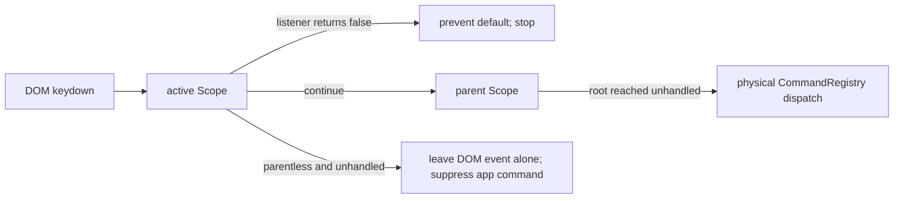

# ADR-0028: Layered keymap scope dispatch

**Date:** 2026-10-01
**Status:** Accepted

## Context

Geode already has two keyboard APIs with different compatibility contracts:

- `CommandRegistry` implements the app's configurable hotkeys using physical
  `KeyboardEvent.code`, as decided in ADR-0011.
- The public Obsidian-compatible `Scope` records plugin handlers expressed as
  logical `KeyboardEvent.key` values. Until now, `Keymap.pushScope` and
  `popScope` were absent, so terminal panes and modal subclasses could not
  temporarily take keyboard control.

A replacement must preserve physical command bindings while letting a focused
plugin surface synchronously block those commands. It must also distinguish a
child scope that inherits the app root from a parentless isolation scope. Guest
IPC, popout windows, chords, and editor-suggest rendering are separate systems
and are not part of this decision.

## Decision

App owns one root `Scope` and one `Keymap`. `Keymap` keeps an identity stack:
`pushScope` appends a scope and `popScope` removes its most recent identity
match. Popping an absent scope or the root is a no-op.

Before `CommandRegistry` maps a DOM event to a physical binding, its optional
synchronous pre-dispatch hook gives the active scope first refusal. `Keymap`
walks from that scope through `Scope.parent`:

Scope matching remains logical and distinct from ADR-0011's command matching:

- `key: null` and `modifiers: null` are wildcards;
- `modifiers: []` means exactly no modifiers;
- non-null modifiers match exactly, with `Mod` resolved to Meta on macOS and
  Control elsewhere;
- a listener returning `false` handled the event, so Geode prevents default,
  stops propagation, and does not dispatch an app command;
- any other return continues through the handler list and parent chain;
- IME composition is not sent to handlers.

Public plugin `Modal` creates a child of `app.scope`, pushes it once on open,
and pops it during close or failed-open rollback. Suggest inputs ignore a
keydown already prevented by their modal scope so a plugin handler and the
built-in selection code cannot both act on the same Enter key.

## Options Considered

| Option | Pros | Cons |
|---|---|---|
| Replace command dispatch with Scope | One keyboard mechanism | Breaks ADR-0011 physical bindings, conflict management, settings, and guest publication |
| Let scopes listen independently on the DOM | Small local changes | Listener order becomes accidental; cannot reliably block commands; cleanup is fragmented |
| **Synchronous Scope gate before CommandRegistry (chosen)** | Preserves both public contracts; deterministic continuation; small integration seam | Host-document only; guest IPC and future popouts need their own explicit integration |

## Consequences

Real plugins can capture focused keyboard input without app hotkeys firing, and
child modal scopes can inherit root handlers. App command storage and display
remain physical-key based. Parentless scopes intentionally isolate commands
without swallowing otherwise unhandled text input.

The two layers must not be conflated: a scope registration using `key: "z"`
follows the logical layout result, while an app command bound to `code: "KeyZ"`
follows the physical key. This is an intentional relationship to ADR-0011, not
an inconsistency.

## Risks

- **Riskiest assumption:** plugin continuation semantics are `false` = handled,
  every other return = continue. The vendored terminal plugin is the real-host
  certificate because its focused scope registers a catch-all and must block a
  Geode hotkey while keeping its terminal input usable.
- A parent cycle could otherwise loop forever; dispatch guards scope identity.
- Guest webviews and popout documents do not run through the host document's
  pre-dispatch gate. Adding them requires a separate design that respects their
  process and ownership boundaries.
