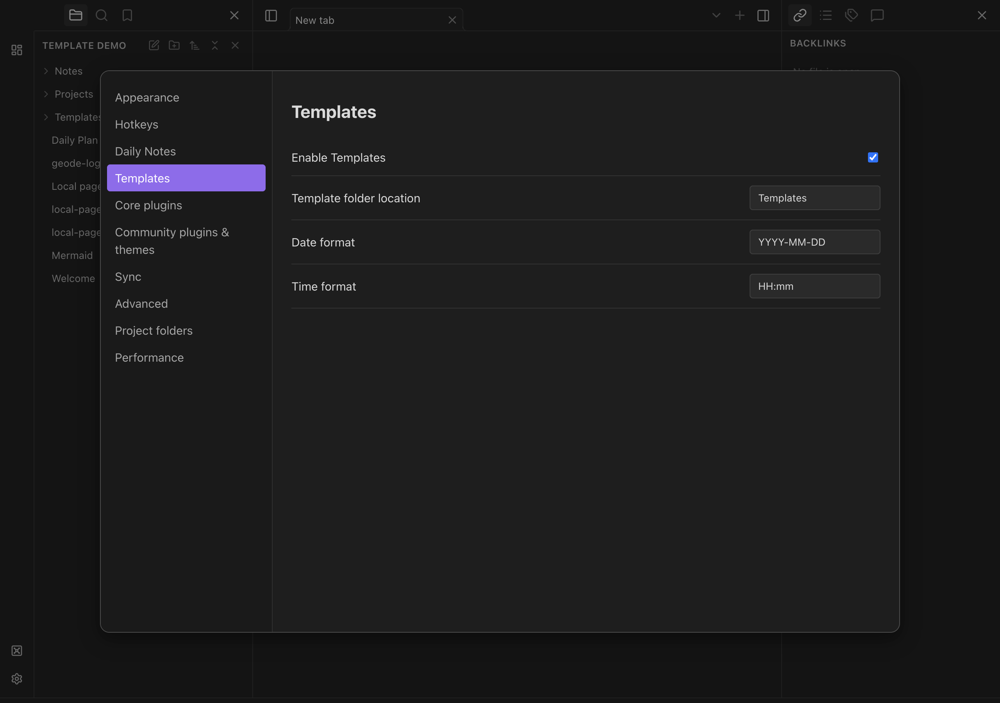
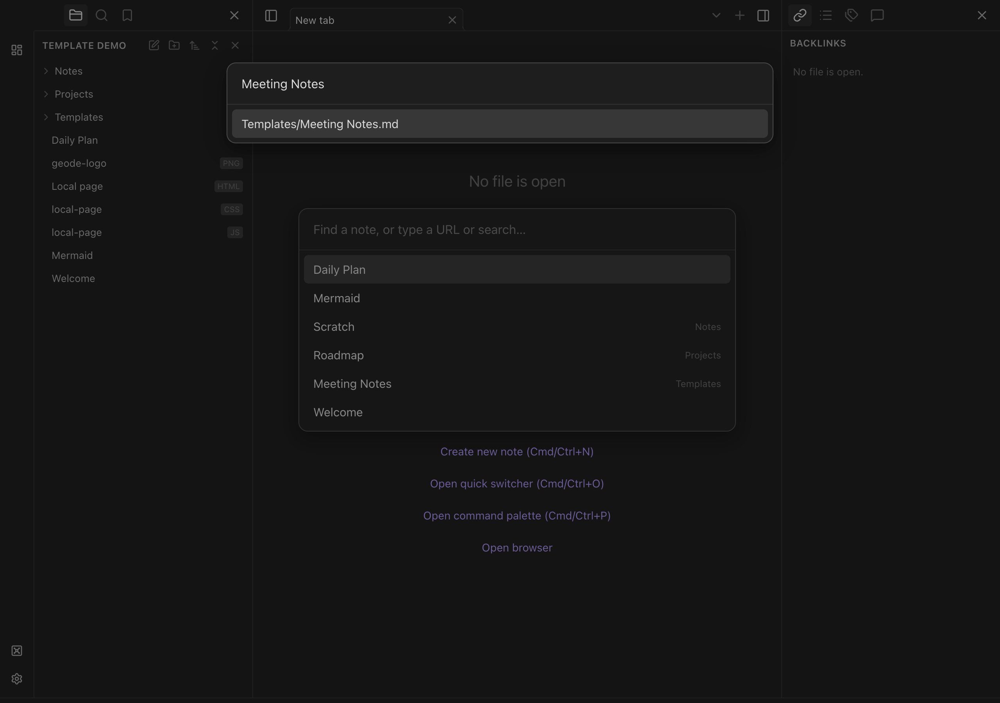
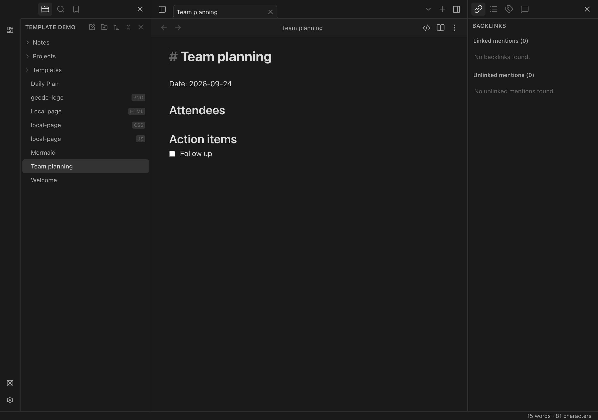

# Using templates

Templates are ordinary Markdown notes in your vault. Open **Settings → Templates**
and set **Template folder location** to their folder (default: `Templates`).
Files in subfolders are included. Templates is enabled by default.

## Create Meeting Notes

1. Put your Meeting Notes template in the configured folder, for example
   `Templates/Meeting Notes.md`.
2. Open the command palette with **Cmd/Ctrl+P** and run **Templates: Create new
   note from template**.
3. Choose **Meeting Notes**, enter a name for the meeting, and press Enter.

Geode creates the note at the vault root and opens it. If that name is already
taken, it adds a numeric suffix; the existing note and template are preserved.
Cancelling either picker or name prompt creates nothing.

To use a template in an existing note, place the cursor or select the text to
replace, then run **Templates: Insert template**. This inserts into the selected
note at its saved cursor/selection. An editable Markdown note must be open.

## Daily Notes

In **Settings → Daily Notes**, set **Template file location** to the template's
vault-relative path, such as `Templates/Daily.md` (`Templates/Daily` also works).
This selects a file, independently of the Templates folder setting.

**Open today's daily note** (**Cmd/Ctrl+D**) applies that template only when
creating a new daily note. Opening an existing daily note preserves its contents;
changing the template does not rewrite it. If a configured template is missing
or unreadable, Geode reports the error and does not create the daily note. Fix
the template path and try again. With no template configured, new daily notes
keep the default date heading.

## Variables and formats

| Variable | Inserted value |
| --- | --- |
| `{{title}}` | The destination note's filename without `.md` |
| `{{date}}` | Today's date in the Templates date format (default `YYYY-MM-DD`) |
| `{{time}}` | Current time in the Templates time format (default `HH:mm`) |
| `{{date:dddd, MMMM D, YYYY}}` | Date using an explicit Moment format |
| `{{time:h:mm A}}` | Time using an explicit Moment format |

Templates settings control the default date/time formats. Daily Notes' date
format controls its filename. Explicit formats inside a template take precedence
over the Templates defaults. Unknown variables stay unchanged; this feature does
not execute Templater scripts or other JavaScript embedded in a template.

**Templates: Insert current date** and **Templates: Insert current time** insert
the configured value directly into the active editor. You can assign shortcuts
to any of these commands in **Settings → Hotkeys**.
