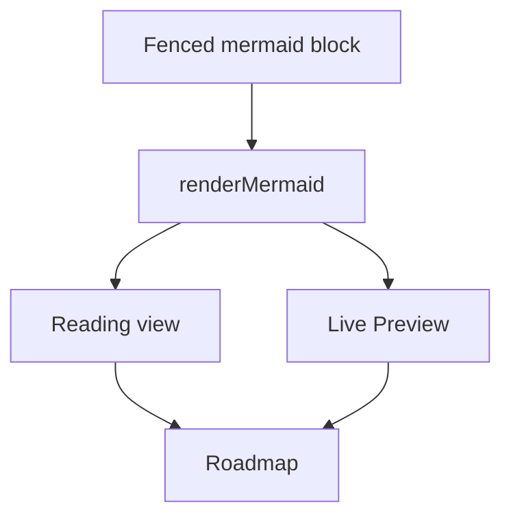
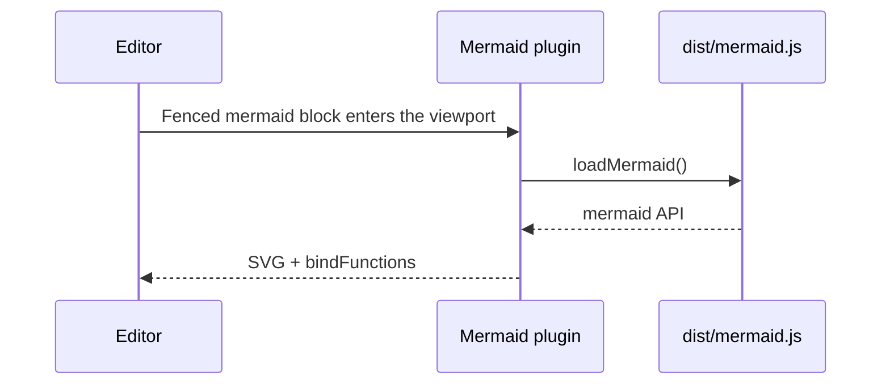

# Mermaid

Fixture note for Mermaid rendering. Exercised by `tests/e2e/mermaid.spec.ts`
and by manual visual verification (`npm start`).

## Flowchart with an internal-link node

The `Roadmap` node is tagged `internal-link`, so clicking it opens
`Projects/Roadmap.md` the same way a wikilink to that note would.



## Sequence diagram



## Deliberately malformed block

This one cannot parse. It must render an inline error and leave the rest of
the note working, rather than throwing.

```mermaid
this is not a valid diagram type
A --> B
```

## After the diagrams

Regular Markdown still renders below, with a [[Welcome]] wikilink intact.
